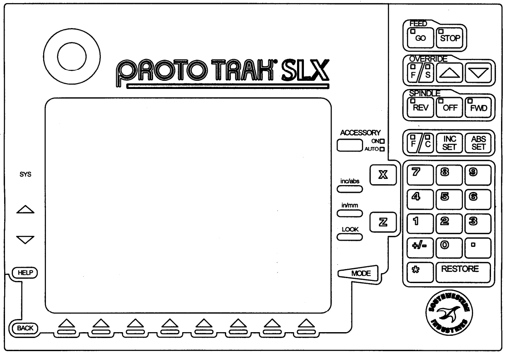
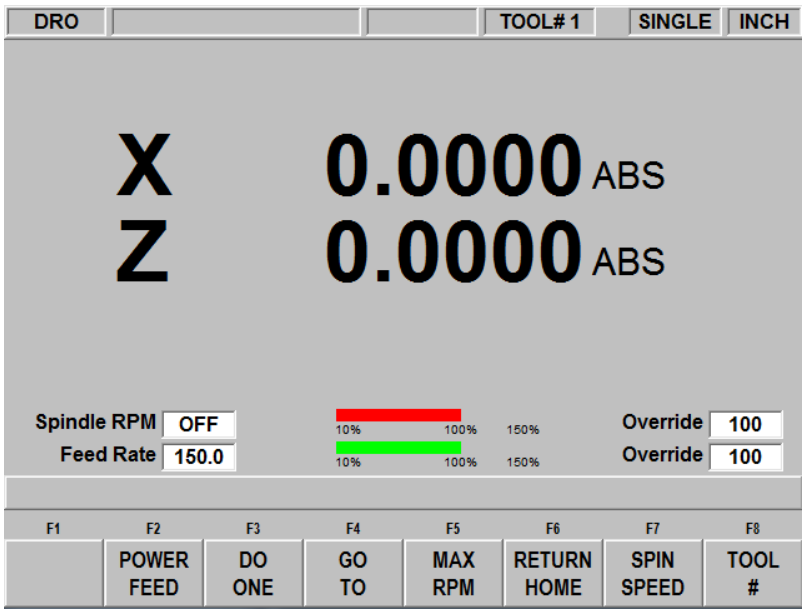
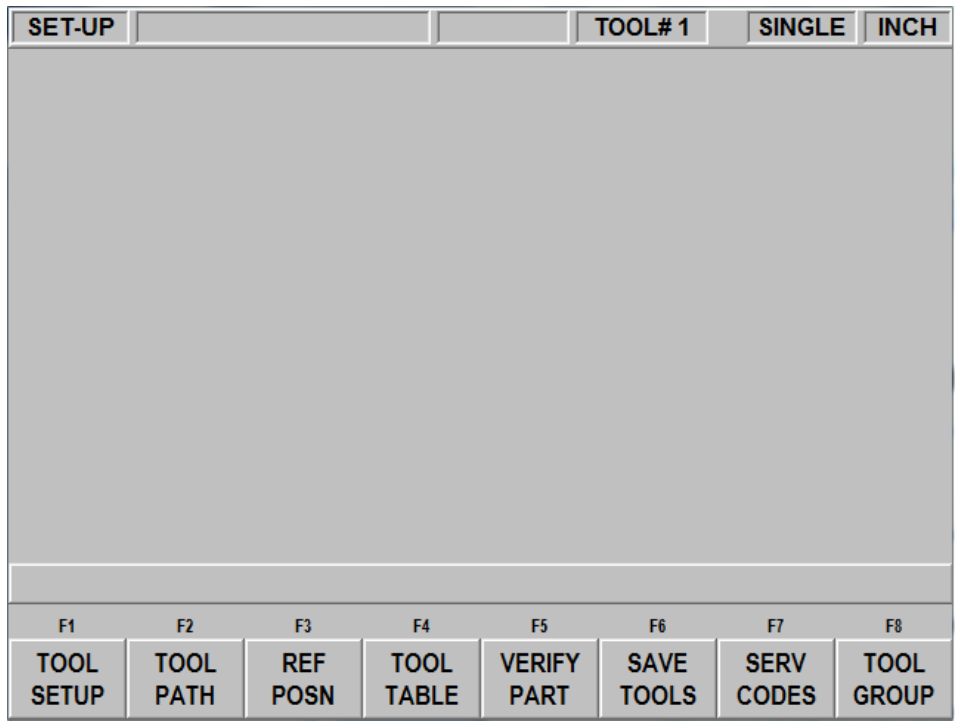
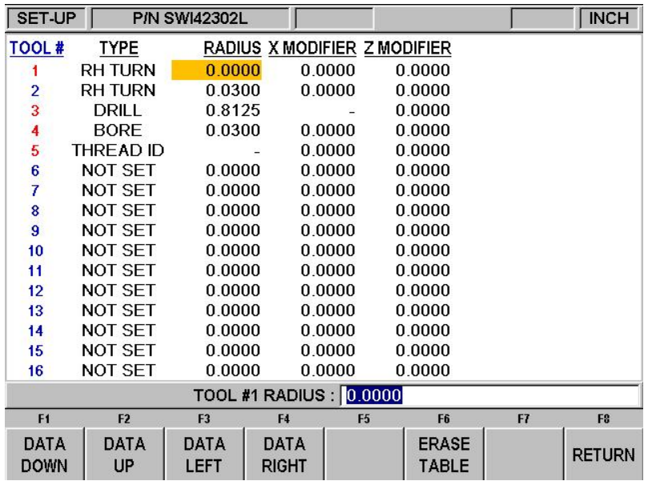
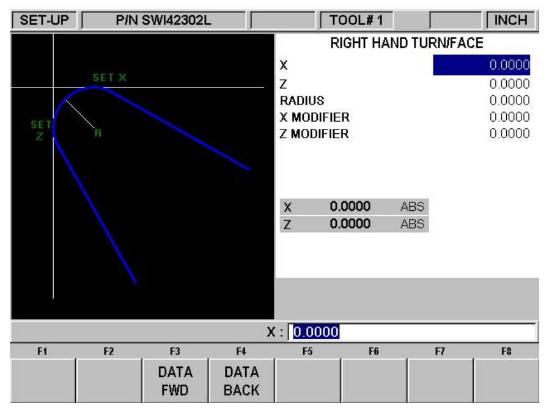

# ProtoTrak Lathe Multiple tool setup

---

This guide is to provide a basic how to for setting up multiple tools in the ProtoTrak Lathe. Prior to setting up tooling ensure you have a **REF POSN** set clear of the stock. Load all tools into tool holders, tighten set screws and inserts, and set tool heights prior to this checklist for best results

---

## SAFETY

```
ENSURE SPINDLE IS OFF BEFORE REACHING INTO LATHE AND HANDLING TOOLS
```

---

### 1: First Tool Setup

Ensure you take your time with this tool as it is the basis of all other tool offsets. Once these zeros are set in the DRO it is critical we do not reset the **DRO** zeros on any other tools and make all offset adjustments in the **SETUP** menus.

1. Load stock into spindle, ensuring enough excess for both **Z** and **X** cuts

2. Press **MODE** -> **SETUP** -> **TOOL SETUP** -> **NEW** now select 1-13 for the selected tool, on the next page take note of the **Z** and **X** references displayed enter any known tool data like **radius** or **width** at this point

3. Select **DRO** mode on display and select **tool #1** (bottom right corner select **TOOL #** enter **1** then press **ABS SET**)

4. Visually inspect and load first tool onto the tool post

5. Move and approach stock in the z direction and make a light facing cut, without moving the hand wheels, select and zero the Z axis (**Z**, **0**, **ABS SET**)

6. Now approach stock in the X direction and turn the OD down enough to fit your micrometers, move the tool away from the stock and measure the diameter with micrometers, Set your X axis (**X**, **enter micrometer reading**, **ABS SET**)

   `Note: when setting this you may find the DRO rounds your number to the nearest .0005" to see the DRO in .0001" increments ensure the Axis feed select is in FINE not CORSE`

7. Now press **MODE** -> **SETUP** -> **TOOL SETUP** -> **EDIT**

8. confirm the X and Z numbers (Top right) match for the tool and absolute (Greyed numbers)

9. Move the machine to the **REF POSN** (home) and confirm tool is in the right place with a scale

### 2. Adding next tool

This is where taking our time with **Tool #1** pays off, first ensure the lathe is in its **REF POSN** as this with ensure we have tool clearance for all tool changes, as if we are colliding with the stock at this point we will need to adjust the home to provide space to load the tool during our program. The basic tool setup is the same as in the first steps for tool #1 however we will not zero the **DRO** with anything other than **TOOL #1**

1. Select **MODE** -> **SETUP** -> **TOOL SETUP** -> **NEW** this will pull up the tool select page enter 1-13 for the appropriate tool

2. Next look at the graphic for the selected tool, take note of the **X** and **Z** reference locations as we will have to touch off of these locations to accurately set the tool offset

3. Now select **MODE** -> **DRO** and check the active tool in the top right corner, if it is not the correct tool press **TOOL #** and enter the correct number

4. Loosen the tool post and remove the previous toolholder and visually inspect the next tool before loading it, once locked and loaded visually confirm tool clearance with the workpiece

5. Next move the tool so that the **Z** reference location from the tool graphic is touching or at a known distance from the workpiece, be mindful to not bump the hand wheels

6. Select **MODE** -> **SETUP** -> **TOOL SETUP** -> **EDIT** and in the **Z** option input the actual location of the tool ie: 0 or .003 if using paper. Now set the **Z** value

7. Select **MODE** -> **DRO** and move the tool to be touching off in the **X** axis again repeat the steps from setting the **Z** position

8. Once both are set press the **RETURN HOME** softkey and confirm position as we did in the Tool #1 setup

If touching off the part is not accurate enough if the stock allows you can easily set the **X** axis by slightly turing the OD down and remeasuring this with you micrometer to know the absolute position, with the **Z** axis this becomes trickier you can move into the negative(left of 0) and turn a boss into the face ensuring you leave some of the original face we turned when zeroing tool #1. Measure this **Z** distance from the original face and keep note of it when entering step **7's X** position

### 3. Adding Additional Tools

Repeat step 2 for all additional tools ensuring you change the active tool within the **DRO** page each time, it can be helpful to keep a list of tool numbers and tools or label each toolholder with the tool number, this makes a nice reference when programming and when changing tools while running programs

### 4. Confirming and Modifying Tool offsets

At this point once all tools are set we should run a test part, while we run this test keep track of which tools turn each features. **Once the test part is complete leaving part in spindle** try to measure an **X** and **Z** reference for each tool used if possible. If these numbers are not where they should be take not of discrepancies and tool # then go back into the **SETUP** -> **TOOL SETUP** -> **EDIT** menu and find the **X MOD** **Z MOD** for the selected tool

- For **Z MOD** a positive number with move the tool that distance away from the spindle/collet

- For **X MOD** a positive here with make the ID/OD larger by that amount for the selected tool

After all adjustments have been made make another test part and confirm the changes, if your part was oversize you can rerun the program again as it hasn't been removed from the spindle so out zeros have not changed, if undersize load new stock and run your test part again, repeat these steps until your tools are cutting accurately.

### 5. Saving Tool Data

Just like with programs the ProtoTrak loses memory after powering off. To save your tool data first press **MODE** -> **SETUP** -> **TOOL TABLE** take a photo or note of these numbers. Then move back to the **SETUP** page and press the **SAVE TOOLS** key. This should save your tool table if the machine powers off, however like with programs its always good to keep photos or save the data to a USB

### 6. Loading new Stock

Now that we have confirmed we are dimensionally accurate we can run our program and start making parts. To start doing this follow these steps

1. Enter **DRO** mode and ensure **TOOL #1** is **BOTH** selected and loaded into the tool post

2. Press **RETURN HOME** to move the tool out of the way and loosen the chuck/collet and insert our stock

3. Start the spindle and approach the stock in the **Z** direction as we did in step 1, take a facing cut and press **Z** enter **0** and **ABS SET**

4. Approach in the **X** direction and turn the OD slighly so that you can measure this, once measured press **X** enter the diameter and press **ABS SET**

5. once the **Z** and **X** axis are zeroed press **RETURN HOME** and you can run your program

### 7. Reference Images



> Note the Location of the MODE button and keypad as these will be used often



> The DRO page note the Active tool is listed on the top right, the tool select softkey F8 and the RETURN HOME softkey F7



> This is the Setup menu note the TOOL SETUP softkey F1, we can modify our reference position from the REF POSN softkey, and view the TOOL TABLE from the F4 softkey



> Tool table displays a list of all tools and a quick view of tool data for each


> These are the tool type choices we can select from when adding tools



> This is the tool setup menu where you can change positions and tool offsets/modifiers
